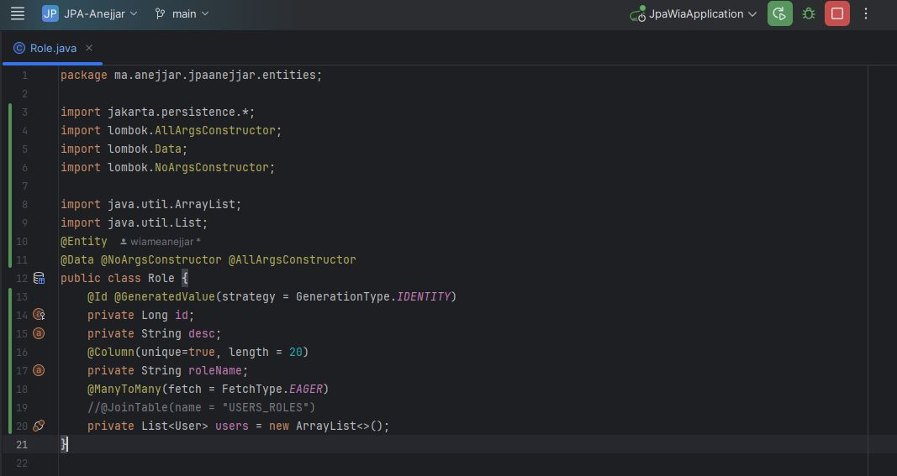
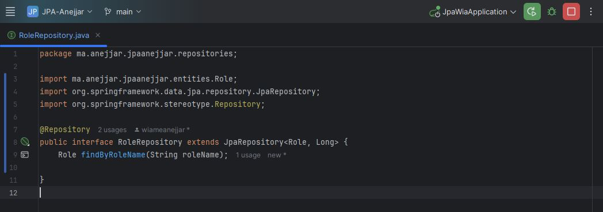
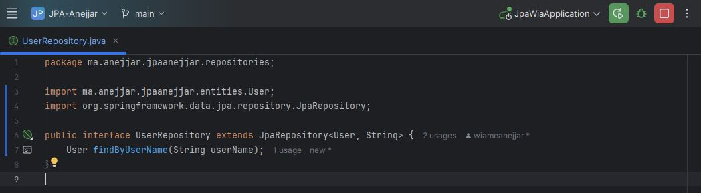

# Rapport de TP - Gestion des Utilisateurs et Rôles avec Spring Boot et JPA

## 📌 Objectif du TP

L’objectif principal de ce TP est de mettre en œuvre une application Spring Boot permettant la gestion des utilisateurs et des rôles, en utilisant JPA (Java Persistence API) pour la persistance des données. Le système doit permettre de :

- Ajouter des utilisateurs.
- Ajouter des rôles.
- Associer des rôles à des utilisateurs.
- Stocker les données en mémoire via H2 Database.

---

## 🧱 Structure du Projet

Le projet est structuré selon les bonnes pratiques de Spring Boot :

- entities: contient les classes User et Role.  
- repositories: interfaces de persistance avec Spring Data JPA.  
- service: interface et implémentation des services métier.  
- Classe principale : JpaWiaApplication.
  
  
## 📄 Explication détaillée des Classes
###  1. Classe `User`:  

La classe User représente une entité JPA (Java Persistence API) correspondant à la table USERS dans la base de données. Elle utilise les annotations de Persistence et Lombok pour simplifier la définition de l'entité. Grâce à l’annotation @Entity, cette classe est automatiquement reconnue par JPA comme une entité persistante. L'annotation @Table(name = "USERS") permet de personnaliser le nom de la table en base de données.  
- La classe possède trois attributs principaux :  
    - userId est la clé primaire de type String, identifiée par l'annotation @Id. Elle permet d'identifier de manière unique chaque utilisateur.  
    - userName est le nom d’utilisateur qui doit être unique dans la base, comme spécifié par @Column(name = "USER_NAME", unique = true, length = 20).  
    - password est le mot de passe de l’utilisateur.

      
La relation entre les utilisateurs et les rôles est modélisée à l’aide de l’annotation @ManyToMany. Elle indique qu’un utilisateur peut avoir plusieurs rôles et qu’un rôle peut être attribué à plusieurs utilisateurs. L'attribut mappedBy = "users" signifie que cette relation est gérée par la propriété users de l'entité Role. Le fetch = FetchType.EAGER signifie que les rôles associés à un utilisateur seront chargés immédiatement avec l'utilisateur. Lombok est utilisé via @Data, @NoArgsConstructor et @AllArgsConstructor pour générer automatiquement les méthodes getters, setters, les constructeurs sans et avec arguments, ainsi que les méthodes toString, equals et hashCode.

    
  ###  2. Classe `Role`:
  Cette classe est une entité JPA représentant la table Role dans la base de données contenant les rôles des utilisateurs (comme "ADMIN", "USER", etc.). Elle est annotée avec @Entity pour signaler à JPA qu’il s’agit d’une entité persistante, et utilise les annotations Lombok @Data, @NoArgsConstructor, et @AllArgsConstructor pour générer automatiquement les méthodes de base (accesseurs, constructeurs, toString, etc.).  
- L’entité contient trois champs principaux :  
   - id : un identifiant unique de type Long, généré automatiquement par la base grâce à l’annotation @GeneratedValue(strategy = GenerationType.IDENTITY). Il sert de clé primaire.
   - desc : une description textuelle du rôle (cet attribut est facultative).  
   - roleName : le nom du rôle (comme "ADMIN", "STUDENT", etc.). Ce champ est unique (@Column(unique=true)), ce qui empêche l’insertion de doublons.  

La relation entre les rôles et les utilisateurs est définie par l’annotation @ManyToMany(fetch = FetchType.EAGER), ce qui indique qu’un rôle peut être attribué à plusieurs utilisateurs et qu’un utilisateur peut avoir plusieurs rôles. Le paramètre fetch = FetchType.EAGER permet de charger immédiatement les utilisateurs liés à un rôle, lors de la récupération du rôle depuis la base. Par défaut, cette relation bidirectionnelle est matérialisée sans @JoinTable, donc JPA gère la table intermédiaire automatiquement.
   
## 🗂️ Repositories
### -  `RoleRepository` : 
Cette classe `RoleRepository`  est une interface qui permet d’accéder aux données de l’entité Role en interagissant avec la base de données. Elle étend JpaRepository<Role, Long>, ce qui signifie qu’elle hérite automatiquement de plusieurs méthodes prédéfinies comme save(), findAll(), findById(), deleteById(), etc., sans avoir besoin de les réécrire. Cela simplifie énormément la gestion des opérations CRUD (Créer, Lire, Mettre à jour, Supprimer).  
Le paramètre Role indique l’entité ciblée, et Long est le type de sa clé primaire (id dans la classe Role). Grâce à l’annotation @Repository, Spring détecte cette interface comme un composant de persistance et s’en sert pour injecter les dépendances dans les services. Des méthodes héritées de JpaRepository, l’interface déclare une méthode personnalisée findByRoleName(String roleName). Cette méthode permet de rechercher un rôle spécifique en fonction de son nom (roleName). Spring Data JPA est capable de générer automatiquement l'implémentation de cette méthode en se basant sur son nom, ce qui évite d’écrire manuellement des requêtes SQL.

   

### -  `UserRepository` :
La classe `UserRepository` est une interface qui permet d’accéder aux données de l’entité User en interagissant avec la base de données. Elle étend JpaRepository<User, String>, ce qui signifie qu’elle hérite automatiquement de plusieurs méthodes prédéfinies comme save(), findAll(), findById(), deleteById(), etc., sans avoir besoin de les implémenter manuellement. Cela simplifie grandement la gestion des opérations CRUD (Créer, Lire, Mettre à jour, Supprimer) sur les utilisateurs.  

Le paramètre User indique l’entité ciblée, et String est le type de sa clé primaire (userId dans la classe User). L’interface ne porte pas d’annotation explicite comme @Repository, mais Spring détecte automatiquement les interfaces qui étendent JpaRepository et les prend en charge comme composants de persistance. L’interface déclare une méthode personnalisée findByUserName(String userName), qui permet de rechercher un utilisateur en fonction de son nom d'utilisateur. Spring Data JPA se base sur le nom de cette méthode pour en générer automatiquement l'implémentation.
   

## 🛠️ Services
### -  Interface `UserService`:
L’interface UserService définit les opérations métiers (logiques de service) liées à la gestion des utilisateurs (User) et des rôles (Role). Elle agit comme une couche d’abstraction entre le contrôleur et la couche de persistance (les repositories). En définissant cette interface, on assure une séparation claire des responsabilités, ce qui facilite la maintenance, le test unitaire et l’extensibilité de l’application. 
  - Les méthodes déclarées dans UserService couvrent les principales opérations nécessaires à la gestion des utilisateurs et de leurs rôles :
       - addNewUser(User user) permet d’ajouter un nouvel utilisateur dans le système.
       - addNewRole(Role role) permet d’ajouter un nouveau rôle.
       - findUserByUserName(String userName) recherche un utilisateur à partir de son nom d’utilisateur.
       - findRoleByRoleName(String roleName) permet de retrouver un rôle à partir de son nom.
       - addRoleToUser(String username, String roleName) permet d’assigner un rôle spécifique à un utilisateur donné.

En créant cette interface, on laisse la liberté d’implémenter ces méthodes dans différentes classes selon les besoins, tout en garantissant que les signatures des méthodes restent cohérentes dans tout le projet.
   
###  Implémentation `UserServiceImpl`:  
La classe UserServiceImpl est l’implémentation concrète de l’interface UserService définie précédemment. Annotée avec @Service, elle est automatiquement détectée par Spring comme un composant de service, ce qui permet de l’injecter dans d’autres parties de l’application. L’annotation @Transactional garantit que toutes les opérations réalisées dans ses méthodes sont exécutées dans une seule transaction, ce qui évite les incohérences de données en cas d’erreur pendant l'exécution.  

Cette classe repose sur deux dépendances injectées via le constructeur grâce à @AllArgsConstructor de Lombok : UserRepository et RoleRepository. Ces deux objets permettent d’interagir avec la base de données pour effectuer les opérations liées aux entités User et Role.  
 - Les méthodes principales sont :
    - addNewUser(User user) : crée un nouvel utilisateur avec un identifiant unique généré automatiquement (UUID) avant de l’enregistrer dans la base.
    - addNewRole(Role role) : enregistre un nouveau rôle dans la base de données.
    - findUserByUserName(String userName) et findRoleByRoleName(String roleName) : permettent de rechercher respectivement un utilisateur ou un rôle à partir de leur nom.
    - addRoleToUser(String username, String roleName) : attribue un rôle à un utilisateur en ajoutant le rôle dans la liste des rôles de l’utilisateur, et l’utilisateur dans la liste des utilisateurs du rôle (relation bidirectionnelle).

Ainsi, UserServiceImpl encapsule la logique métier de gestion des utilisateurs et des rôles tout en déléguant l’accès aux données aux repositories.
   
   

  - Résultat Attendu
Au lancement de l’application :
    - Les utilisateurs et rôles sont insérés automatiquement.
    - Les relations entre utilisateurs et rôles sont établies.
    - On peut visualiser les tables via l’interface H2 (/h2-console), avec le JDBC URL jdbc:h2:mem:users_db.

