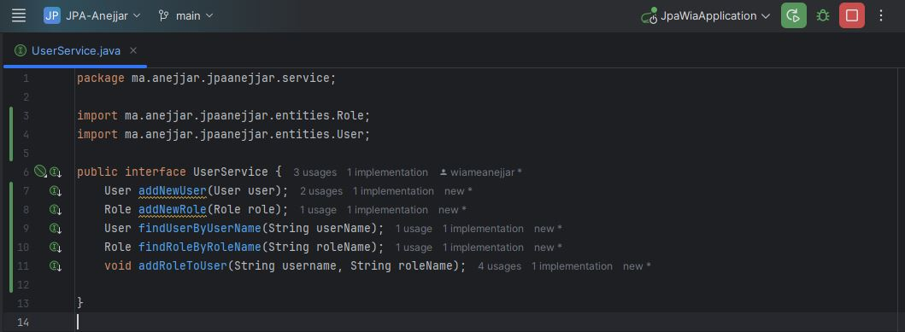
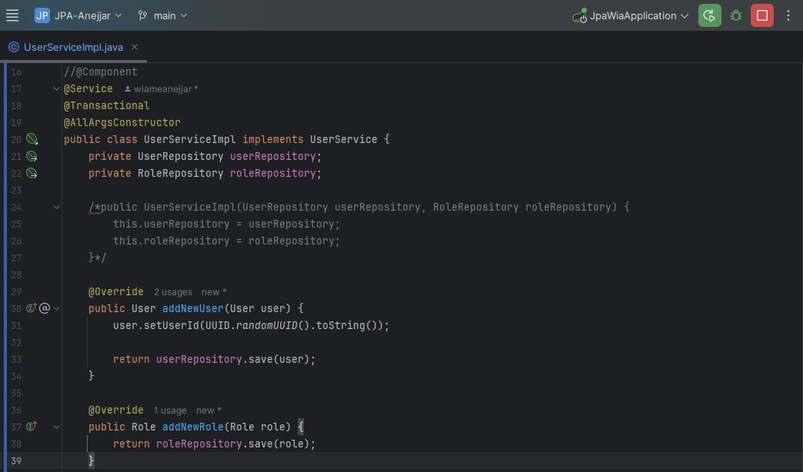
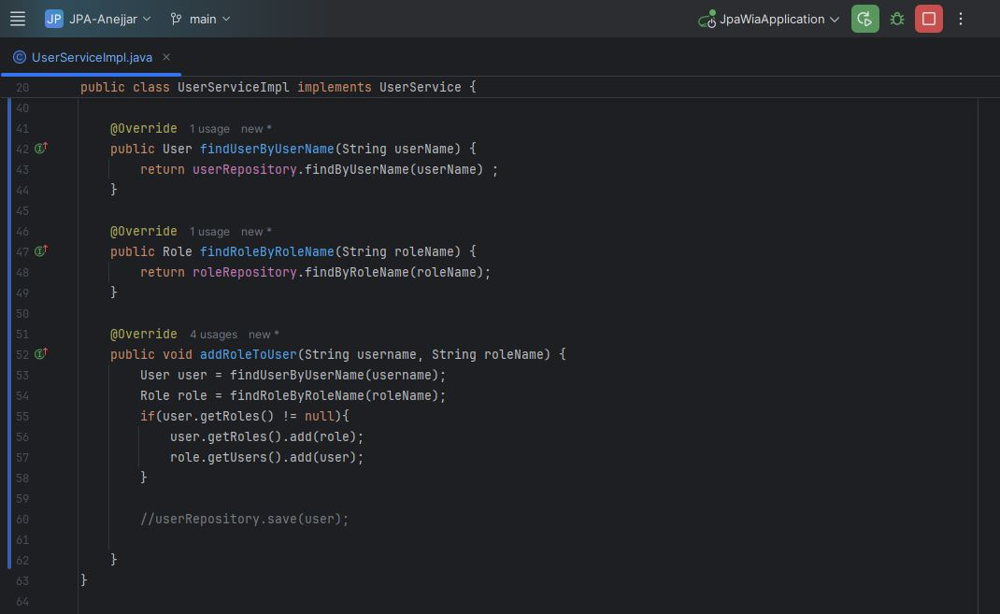
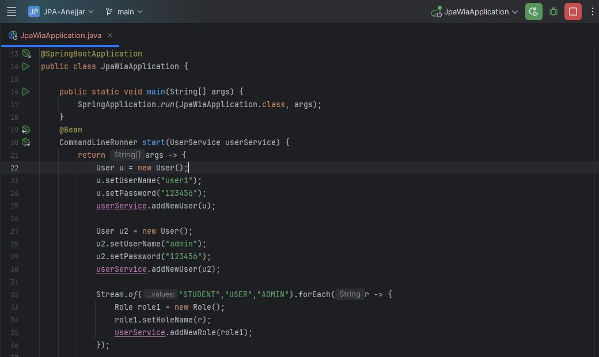
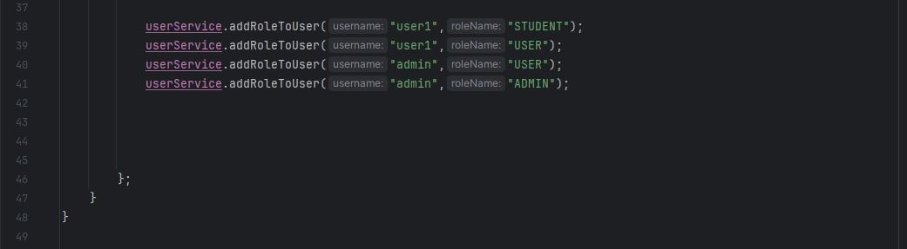

# Rapport de TP - Gestion des Utilisateurs et Rôles avec Spring Boot et JPA

## 📌 Objectif du TP

L’objectif principal de ce TP est de mettre en œuvre une application Spring Boot permettant la gestion des utilisateurs et des rôles, en utilisant JPA (Java Persistence API) pour la persistance des données. Le système doit permettre de :

- Ajouter des utilisateurs.
- Ajouter des rôles.
- Associer des rôles à des utilisateurs.
- Stocker les données en mémoire via H2 Database.

---

## 🧱 Structure du Projet

Le projet est structuré selon les bonnes pratiques de Spring Boot :

- entities: contient les classes User et Role.  
- repositories: interfaces de persistance avec Spring Data JPA.  
- service: interface et implémentation des services métier.
- web : contient le contrôleur UserController, qui gère les requêtes HTTP liées aux utilisateurs.
- Classe principale : JpaFsApplication.
  
  
## 📄 Explication détaillée des Classes
###  1. Classe `User`:  

La classe User représente une entité JPA (Java Persistence API) correspondant à la table USERS dans la base de données. Elle utilise les annotations JPA pour la persistance, Lombok pour la génération automatique de code standard, et Jackson pour gérer la sérialisation JSON. Grâce à l’annotation @Entity, cette classe est automatiquement reconnue par JPA comme une entité persistante. L’annotation @Table(name = "USERS") permet de spécifier explicitement le nom de la table à utiliser en base de données.
 - La classe contient trois attributs principaux :  
       - userId est la clé primaire de type String, marquée avec l’annotation @Id, ce qui permet d’identifier de manière unique chaque utilisateur dans la table.  
       - userName correspond au nom de l’utilisateur. Il est annoté avec @Column(name = "USER_NAME", unique = true, length = 20) pour indiquer que cette colonne doit être unique dans la base de données et que sa taille maximale est de 20 caractères.  
       - password est le mot de passe de l’utilisateur. Il est annoté avec @JsonProperty(access = JsonProperty.Access.WRITE_ONLY), ce qui signifie que ce champ ne sera pas inclus dans les réponses JSON (lecture interdite), mais pourra être utilisé lors des envois (écriture autorisée uniquement). Cela permet de renforcer la sécurité en évitant de divulguer le mot de passe dans les échanges de données JSON.

     
La relation entre les utilisateurs et les rôles est modélisée à l’aide de l’annotation @ManyToMany. Elle indique qu’un utilisateur peut avoir plusieurs rôles et qu’un rôle peut être associé à plusieurs utilisateurs.
  - L’attribut mappedBy = "users" signifie que cette relation est gérée du côté de l’entité Role via l’attribut users.
  - fetch = FetchType.EAGER indique que la liste des rôles associés sera automatiquement chargée en même temps que l’utilisateur.
  - Lombok est utilisé avec les annotations @Data, @NoArgsConstructor et @AllArgsConstructor :
       - @Data génère automatiquement les méthodes getters, setters, toString, equals et hashCode.
       - @NoArgsConstructor génère un constructeur sans arguments.
       - @AllArgsConstructor génère un constructeur avec tous les attributs en arguments.

    
  ###  2. Classe `Role`:
  Cette classe est une entité JPA qui représente la table Role  dans la base de données, utilisée pour gérer les autorisations des utilisateurs (comme "ADMIN", "USER", etc.). Annotée avec @Entity, elle est persistée automatiquement par JPA. Elle utilise Lombok (@Data, @NoArgsConstructor, @AllArgsConstructor) pour générer automatiquement les méthodes standards.   
  La classe contient trois attributs :
   - id, une clé primaire de type Long générée automatiquement.
   - desc, une description facultative du rôle.
   - roleName, le nom du rôle, unique et limité à 20 caractères.
   
La relation entre Role et User est définie par @ManyToMany(fetch = FetchType.EAGER), indiquant qu’un rôle peut être partagé entre plusieurs utilisateurs et inversement.  
L’annotation @JsonProperty(access = JsonProperty.Access.WRITE_ONLY) empêche la liste des utilisateurs d’être exposée dans les réponses JSON, et @ToString.Exclude évite les boucles infinies lors de l’affichage de l’objet.
   
## 🗂️ Repositories
### - Interface `RoleRepository` : 
La classe `RoleRepository` est une interface de persistance qui permet de manipuler les données de l'entité Role en interagissant directement avec la base de données. Elle hérite de JpaRepository<Role, Long>, ce qui lui confère automatiquement des méthodes de base pour les opérations CRUD (comme save(), findById(), findAll(), deleteById(), etc.), sans nécessiter d’implémentation manuelle. Le type Role désigne l'entité à gérer, et Long est le type de sa clé primaire (id). Annotée avec @Repository, cette interface est reconnue par Spring comme un composant de persistance injectable. Elle contient également une méthode personnalisée findByRoleName(String roleName), qui permet de rechercher un rôle à partir de son nom.  
Spring Data JPA est capable de générer automatiquement l'implémentation de cette méthode en se basant sur son nom, ce qui évite d’écrire manuellement des requêtes SQL.

   

### - Interface `UserRepository` :
L’interface UserRepository permet d’accéder aux données de l’entité User en interagissant avec la base de données. Elle étend JpaRepository<User, String>, ce qui lui donne accès à toutes les méthodes CRUD de base sans avoir besoin de les implémenter. Le paramètre User désigne l’entité gérée, et String est le type de sa clé primaire (userId). Bien qu’elle ne soit pas annotée avec @Repository, Spring reconnaît automatiquement cette interface comme un composant de persistance grâce à l’extension de JpaRepository. Elle déclare également une méthode personnalisée findByUserName(String userName), qui permet de retrouver un utilisateur à partir de son nom d’utilisateur. Spring Data JPA génère automatiquement son implémentation en se basant sur le nom de la méthode.
   

## 🛠️ Services
### -  Interface `UserService`:
L’interface UserService définit les opérations métiers (logiques de service) liées à la gestion des utilisateurs (User) et des rôles (Role). Elle agit comme une couche d’abstraction entre le contrôleur et la couche de persistance (les repositories). En définissant cette interface, on assure une séparation claire des responsabilités, ce qui facilite la maintenance, le test unitaire et l’extensibilité de l’application. 
  - Les méthodes déclarées dans UserService couvrent les principales opérations nécessaires à la gestion des utilisateurs et de leurs rôles :
       - addNewUser(User user) permet d’ajouter un nouvel utilisateur dans le système.
       - addNewRole(Role role) permet d’ajouter un nouveau rôle.
       - findUserByUserName(String userName) recherche un utilisateur à partir de son nom d’utilisateur.
       - findRoleByRoleName(String roleName) permet de retrouver un rôle à partir de son nom.
       - addRoleToUser(String username, String roleName) permet d’assigner un rôle spécifique à un utilisateur donné.

En créant cette interface, on laisse la liberté d’implémenter ces méthodes dans différentes classes selon les besoins, tout en garantissant que les signatures des méthodes restent cohérentes dans tout le projet.
   
###  - Implémentation `UserServiceImpl`:  
La classe UserServiceImpl est l’implémentation concrète de l’interface UserService définie précédemment. Annotée avec @Service, elle est automatiquement détectée par Spring comme un composant de service, ce qui permet de l’injecter dans d’autres parties de l’application. L’annotation @Transactional garantit que toutes les opérations réalisées dans ses méthodes sont exécutées dans une seule transaction, ce qui évite les incohérences de données en cas d’erreur pendant l'exécution.  

Cette classe repose sur deux dépendances injectées via le constructeur grâce à @AllArgsConstructor de Lombok : UserRepository et RoleRepository. Ces deux objets permettent d’interagir avec la base de données pour effectuer les opérations liées aux entités User et Role.  
 - Les méthodes principales sont :
    - addNewUser(User user) : crée un nouvel utilisateur avec un identifiant unique généré automatiquement (UUID) avant de l’enregistrer dans la base.
    - addNewRole(Role role) : enregistre un nouveau rôle dans la base de données.
    - findUserByUserName(String userName) et findRoleByRoleName(String roleName) : permettent de rechercher respectivement un utilisateur ou un rôle à partir de leur nom.
    - addRoleToUser(String username, String roleName) : attribue un rôle à un utilisateur en ajoutant le rôle dans la liste des rôles de l’utilisateur, et l’utilisateur dans la liste des utilisateurs du rôle (relation bidirectionnelle).

Ainsi, UserServiceImpl encapsule la logique métier de gestion des utilisateurs et des rôles tout en déléguant l’accès aux données aux repositories.
   
   

## --  Classe Principale `JpaWiaApplication`:
Cette classe représente le point d'entrée principal de l'application Spring Boot. Annotée avec @SpringBootApplication, elle configure automatiquement tous les composants nécessaires au démarrage de l'application. La méthode main() lance l'application grâce à SpringApplication.run(). En plus de cela, la méthode start() annotée avec @Bean retourne un CommandLineRunner, une interface permettant d'exécuter du code automatiquement au démarrage de l'application. À l’intérieur de cette méthode, on crée deux utilisateurs (user1 et admin) avec des mots de passe, puis on crée trois rôles (STUDENT, USER, ADMIN) à l’aide du service UserService. Ensuite, des rôles sont assignés aux utilisateurs : user1 reçoit les rôles STUDENT et USER, tandis que admin reçoit les rôles USER et ADMIN. Ce code permet donc d'initialiser automatiquement des données de test dès le lancement de l’application, ce qui est très utile pour les phases de développement.
   
   

## ⚙️ Configuration (`application.properties`):
Ce fichier application.properties contient les paramètres de configuration de l’application Spring Boot, en particulier pour la connexion à la base de données et le comportement de JPA/Hibernate.
  - server.port=8083 indique que l’application web sera accessible sur le port 8083.
  - La ligne spring.datasource.url=jdbc:mysql://localhost:3306/USERS_DB?createDatabaseIfNotExist=true configure la connexion à une base de données MySQL nommée USERS_DB, qui sera créée automatiquement si elle n'existe pas.
  - spring.datasource.username=root et spring.datasource.password= spécifient les identifiants de connexion à la base de données (ici, l'utilisateur root sans mot de passe).
  - spring.jpa.hibernate.ddl-auto=create indique à Hibernate de recréer les tables de la base de données à chaque démarrage de l’application, ce qui est utile en phase de développement.
  - spring.jpa.properties.hibernate.dialect = org.hibernate.dialect.MariaDBDialect informe Hibernate du dialecte SQL à utiliser, ici adapté à MariaDB (et compatible avec MySQL).
  - spring.jpa.show-sql=true permet d'afficher les requêtes SQL générées par Hibernate dans la console, pratique pour le débogage.
     

  - Résultat Attendu
Au lancement de l’application :
    - Les utilisateurs et rôles sont insérés automatiquement.
    - Les relations entre utilisateurs et rôles sont établies.
    - On peut visualiser les tables via l’interface H2 (/h2-console), avec le JDBC URL jdbc:h2:mem:users_db.

 ## - Conclusion
Ce TP m'a permis de réaliser une application simple mais complète de gestion des utilisateurs et des rôles avec Spring Boot, JPA et une base de données MySQL.Les fonctionnalités essentielles de création, recherche, et association entre utilisateurs et rôles ont été implémentées avec succès.

