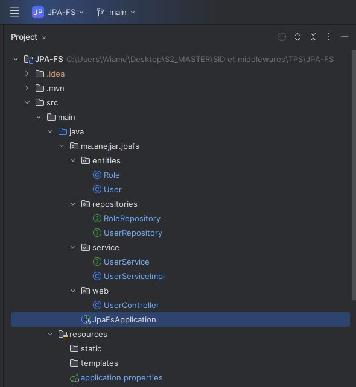
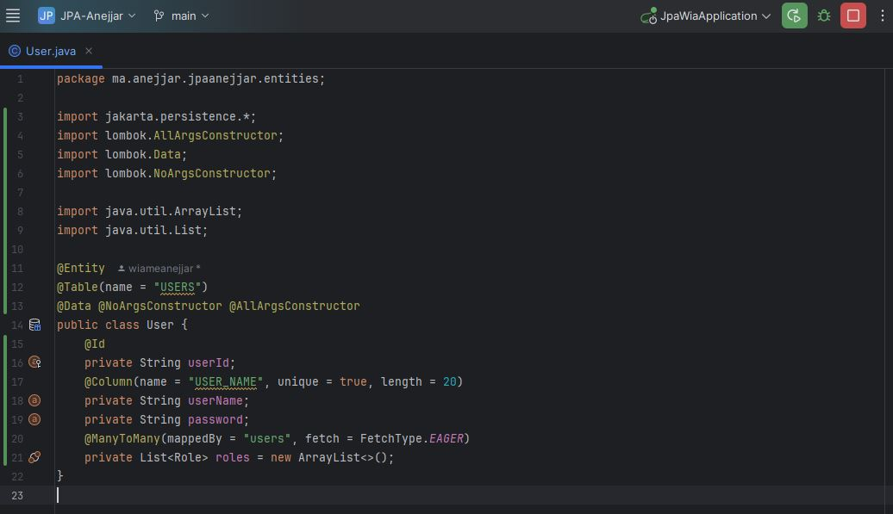

# Rapport de TP - Gestion des Utilisateurs et Rôles avec Spring Boot et JPA

## 📌 Objectif du TP

L’objectif principal de ce TP est de mettre en œuvre une application Spring Boot permettant la gestion des utilisateurs et des rôles, en utilisant JPA (Java Persistence API) pour la persistance des données. Le système doit permettre de :

- Ajouter des utilisateurs.
- Ajouter des rôles.
- Associer des rôles à des utilisateurs.
- Stocker les données en mémoire via H2 Database.

---

## 🧱 Structure du Projet

Le projet est structuré selon les bonnes pratiques de Spring Boot :

- entities: contient les classes User et Role.  
- repositories: interfaces de persistance avec Spring Data JPA.  
- service: interface et implémentation des services métier.  
- Classe principale : JpaWiaApplication.
  
  
## 📄 Explication détaillée des Classes
###  1. Classe `User`:  

La classe User représente une entité JPA (Java Persistence API) correspondant à la table USERS dans la base de données. Elle utilise les annotations de Persistence et Lombok pour simplifier la définition de l'entité. Grâce à l’annotation @Entity, cette classe est automatiquement reconnue par JPA comme une entité persistante. L'annotation @Table(name = "USERS") permet de personnaliser le nom de la table en base de données.  
- La classe possède trois attributs principaux :  
    - userId est la clé primaire de type String, identifiée par l'annotation @Id. Elle permet d'identifier de manière unique chaque utilisateur.  
    - userName est le nom d’utilisateur qui doit être unique dans la base, comme spécifié par @Column(name = "USER_NAME", unique = true, length = 20).  
    - password est le mot de passe de l’utilisateur.

      
La relation entre les utilisateurs et les rôles est modélisée à l’aide de l’annotation @ManyToMany. Elle indique qu’un utilisateur peut avoir plusieurs rôles et qu’un rôle peut être attribué à plusieurs utilisateurs. L'attribut mappedBy = "users" signifie que cette relation est gérée par la propriété users de l'entité Role. Le fetch = FetchType.EAGER signifie que les rôles associés à un utilisateur seront chargés immédiatement avec l'utilisateur. Lombok est utilisé via @Data, @NoArgsConstructor et @AllArgsConstructor pour générer automatiquement les méthodes getters, setters, les constructeurs sans et avec arguments, ainsi que les méthodes toString, equals et hashCode.

    
  ###  2. Classe `Role`:
  Cette classe est une entité JPA représentant la table Role dans la base de données contenant les rôles des utilisateurs (comme "ADMIN", "USER", etc.). Elle est annotée avec @Entity pour signaler à JPA qu’il s’agit d’une entité persistante, et utilise les annotations Lombok @Data, @NoArgsConstructor, et @AllArgsConstructor pour générer automatiquement les méthodes de base (accesseurs, constructeurs, toString, etc.).  
- L’entité contient trois champs principaux :  
   - id : un identifiant unique de type Long, généré automatiquement par la base grâce à l’annotation @GeneratedValue(strategy = GenerationType.IDENTITY). Il sert de clé primaire.
   - desc : une description textuelle du rôle (cet attribut est facultative).  
   - roleName : le nom du rôle (comme "ADMIN", "STUDENT", etc.). Ce champ est unique (@Column(unique=true)), ce qui empêche l’insertion de doublons.  

La relation entre les rôles et les utilisateurs est définie par l’annotation @ManyToMany(fetch = FetchType.EAGER), ce qui indique qu’un rôle peut être attribué à plusieurs utilisateurs et qu’un utilisateur peut avoir plusieurs rôles. Le paramètre fetch = FetchType.EAGER permet de charger immédiatement les utilisateurs liés à un rôle, lors de la récupération du rôle depuis la base. Par défaut, cette relation bidirectionnelle est matérialisée sans @JoinTable, donc JPA gère la table intermédiaire automatiquement.

